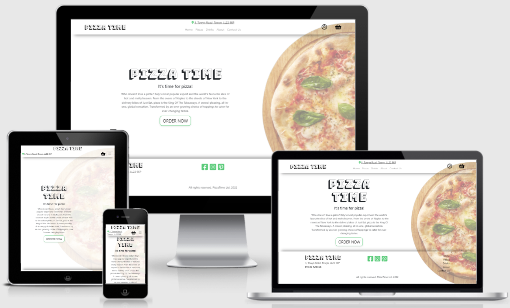
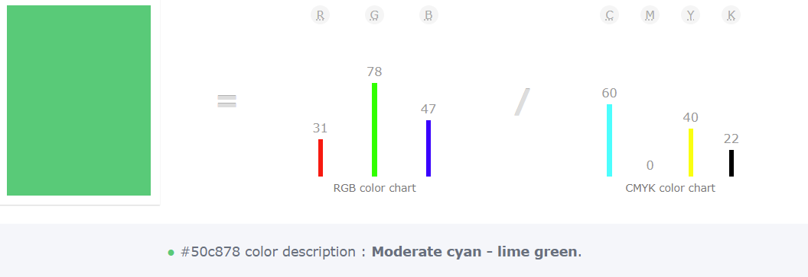
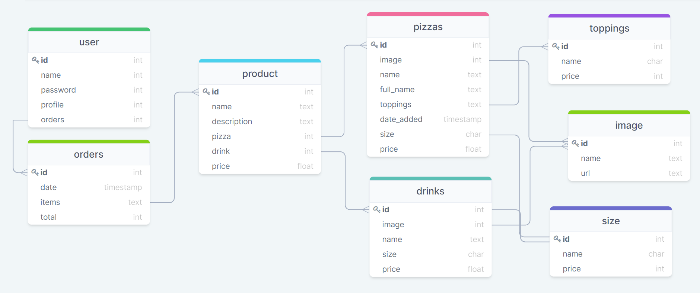

# **PizzaTime** Readme




### Deployed Project @ Heroku: [https://pizza-time-ms4-po.herokuapp.com/](https://pizza-time-ms4-po.herokuapp.com/)
### Github Repository: [https://github.com/pjotrs-osnovskis/pizza_time_MS4](https://github.com/pjotrs-osnovskis/pizza_time_MS4)

---
<br>

## **GOAL**

Welcome to Pizza Time in Towyn, we offer highest quality pizza and free delivery across Towyn.

This project is my final one in [Code Institute's](https://codeinstitute.net/) Full Stack Web Development course.
I was back home over Christmas and we ordered a pizza, we had to ring them and explain what we want, it wasn't very convenient. So this situation inspired me to build
[PizzaTime](https://pizza-time-ms4-po.herokuapp.com/). The place we got pizza from was: [Mana Pica](http://manapica.lv/lv).

> Note: I borrowed images and some visual ideas from there only for study purposes.

---
<br>

## **Table of contents**

* [UX](#ux)
    * [User Goals](#user-goals)
    * [Owner Goals](#owner-goals)
    * [User Stories](#user-stories)
    * [Design](#design)
        * [Color](#color)
        * [Fonts](#fonts)
        * [Structure](#structure)
* [Wireframes and Database](#wireframes-and-database)
    * [Wireframes](#wireframes)
    * [Database Structure](#databse-structure)
* [Technologies Used](#technologies-used)
* [Testing](#testing)
* [Deployment](#deployment)
    * [Setting up the project](#setting-up-the-project)
    * [Clone the project](#clone-the-project)
    * [Heroku Deployment](#heroku-deployment)
* [Credits](#credits)

<br>
---
<br>

## **UX**

### **USER GOALS**

* The home page should create a nice feeling and motivate users to explore it further
* App must be responsive and work well across different variety of devices
* Be able to see all pizzas and drinks separately, categorized.
* Be able to place an order online and pay for it.

[Back to Top](#table-of-contents)

<br>

### **OWNER GOALS**

As an owner I want:

* to add new products
* to edit or delete existing products
* to see a list of all existing products
* to have a separate page for CRUD manipulations available only for staff users

[Back to Top](#table-of-contents)

<br>

### **USER STORIES**

| ID | AS A/AN   | I WANT TO…                                                        | SO I CAN…                                                                  |
|----|-----------|-------------------------------------------------------------------|----------------------------------------------------------------------------|
|    |           |**Viewing and Navigation**                                         |                                                                            |
| 1  | Customer  | View a list of products                                           | Select products to order                                                   |
| 2  | Customer  | View individual product information                               | Identify the price, ingredients, likes, image and sizes                    |
| 3  | Customer  | Easily view the total amount of my purchases at any time          | Keep control on my spendings, avoid errors                                 |
| 4  | Customer  | Contact Business in variety of ways                               | Phone number, Address, Contact Form                                        |
|<br>|           |                                                                   |                                                                            |
|    |           |**Registration and User Accounts**                                 |                                                                            |
| 5  | Site User | Easily register an account                                        | Register an account to view own profile                                    |
| 6  | Site User | Log in and log out                                                | Access my personal account                                                 |
| 7  | Site User | Password recovery                                                 | Recover access to my personal account                                      |
| 8  | Site User | Email confirmation after registering                              | Verify successful account registration                                     |
| 9  | Site User | Personalized user profile                                         | Save delivery and payment preferences, view order history                  |
| 10 | Site User | Purchase free delivery subscription                               | Pay monthly fee and save in case of frequent orders                        |
|<br>|           |                                                                   |                                                                            |
|    |           |**Products**                                                       |                                                                            |
| 11 | Customer  | Browse available products by category                             | Easily identify products by category                                       |
| 12 | Customer  | See popularity of a product                                       | See how many 'likes' there is for a specific product                       |
| 13 | Customer  | 'Like' a product                                                  | Like a product to increase its popularity                                  |
|<br>|           |                                                                   |                                                                            |
|    |           |**Ordering and Checkout**                                          |                                                                            |
| 14 | Customer  | Select size and quantity of a product I want to order             | Ensure I don’t accidentally select the wrong product, its quantity or size |
| 15 | Customer  | View products in shopping bag to be ordered                       | Ensure the total cost of my order and all products I will receive          |
| 16 | Customer  | Adjust the quantity of individual items in my bag                 | Easily make changes to my order before checkout                            |
| 17 | Customer  | Easily enter/choose payment method                                | Check out quickly and easily                                               |
| 18 | Customer  | Ensure that my personal and payment information is safe and secure| Confidently provide the information needed to complete an order            |
| 19 | Customer  | View an order confirmation after checkout                         | Verify that I haven't made any mistakes in my order                        |
| 20 | Customer  | Receive an email confirmation after checking out                  | Keep the confirmation of my order details for own records                  |
|<br>|           |                                                                   |                                                                            |
|    |           |**Admin and Store Management**                                     |                                                                            |
| 21 | Owner     | Add a product                                                     | Add new items to my store                                                  |
| 22 | Owner     | Edit/Update a product                                             | Change product name, image, items, price, etc.                             |
| 23 | Owner     | Delete a product                                                  | Remove items that are no longer available.                                 |

[Back to Top](#table-of-contents)

<br>

### **DESIGN**

As mentioned above, I was inspired by an existing place "[Mana Pica](http://manapica.lv/lv)" back home,
I though to use a bit cleaner design as it felt like a bit too much all around, especially in their header.

#### **Color**



Image created via [https://www.colorhexa.com/](https://www.colorhexa.com/)

In other sources this color is called **Emerald**, I chose this color to be main theme as, in my eyes, it represents something healthy,
and associates with herbs like Basil that is commonly used in pizzas. Thought to keep it simple and use one one color, not to overload users.


[Back to Top](#table-of-contents)

<br>

#### **Fonts**

**Bungee Shade**


Fonts used from [https://fonts.google.com/](https://fonts.google.com/)

Kept it simple and used one font for logo. I know pizza is Italian, but for some reason I have association with America, same as this font. Has a feeling that this is the one.
General fonts for paragraphs and headings are simple and readable.

[Back to Top](#table-of-contents)

<br>

#### **Structure**

Main idea behind websites structure was - simplicity. Navigation and footer on all pages, hero image covered by overlay with opacity for overall readability.

* Home Page
    Has a simple message and **Order Now** button. Inviting user to browse through available pizzas and drinks.

* Pizzas and Drinks
    Simple and responsive list of products. Has variety of options like Size, Quantity and also Likes, authenticated users can "Like" a product, so others can see how popular is this ot that product and make a decision in case they haven't tried it before.

* About
    Again, kept it simple, can see delivery area, and main information with phone numbers, address and link to contact form in case user is willing to use it.

* Contact Us
    A simple and understandable form.

* Navigation
    Easy to understand, with main paiges to navigate across website as well as authentication links under an familiar 'User' icon. Shopping bag icon with grand total in case there is one.

* Footer
    Very basic footer with address, social media and navigation links.

* Authentication
    Used Django Allauth application, styled to project overall design

* Users Order
    A list of ordered items, with options to update quantity ot remove item. Brand total and Checkout button at the bottom.

* Checkout
    Using [Stripe](https://stripe.com/gb) for payments and [Crispy](https://django-crispy-forms.readthedocs.io/en/latest/) forms for delivery and billing information. Order summary for order confirmation. Leading to Checkout Success page with order, payment and delivery information. 

[Back to Top](#table-of-contents)

---
<br>

## **Wireframes and Database**

### **WIREFRAMES**

I used [Balsamic](https://balsamiq.com/wireframes/) to create wireframes for my project.   

* [Home page](docs/img/wireframes/home.png)  
* [Login](docs/img/wireframes/log-in.png)  
* [Register](docs/img/wireframes/register.png)  
* [My Profile](docs/img/wireframes/profile.png)  
* [My Order](docs/img/wireframes/my-order.png)
* [Delivery & Payment](docs/img/wireframes/delivery-payment.png)
* [Contact Us](docs/img/wireframes/contact-us.png)
* [Delivery Info/About Us/Allergy Advice](docs/img/wireframes/info.png)  

[Back to Top](#table-of-contents)

<br>

### **DATABASE STRUCTURE**

I used [drawSQL](https://drawsql.app/) to structure database for this project. See image below to see all connections between DB models.



During development Database structure has changed. First I have removed separate pizza and drinks models and size models and combined it in to one Product model. Then, since it is in criteria to have two of own classes I created another Address class with address information and phone number. I thought in case of any changes it will be convenient to simply change information, like phone number, in the admin. If I would have more time for the project, I could create more models like this for easy information manipulation.

[Back to Top](#table-of-contents)

---
<br>

## **FEATURES**

### **IMPLEMENTED FEATURES**

* Registration and Login using Django's Allauth
* Size, quantity selection on products before adding to order
* Quantity update or item remove in the order page
* Likes, add remove and view count of them on every product
* Checkout and payments using [Stripe](https://stripe.com/gb)
* Superuser / Staff accounts to manipulate CRUD on products

### **POTENTIAL FEATURES TO BE IMPLEMENTED**

* Dark theme for user convenience, most orders fall out on evenings when dark.
* Update order Model to see payment status, paid or not, show it in Superuser page
* Update order Model to select order status, create separate app for pizza place to select, what stage customers order is, so customer can track it. Like, "Accepted", "Out For Delivery", etc.
* Update product Model so customer can change desired toppings, say 2 are free to change or add extra topping, Topping model is ready for it.
* Add collection option, in case customer want to collect

[Back to Top](#table-of-contents)

---
<br>

## **TECHNOLOGIES USED**

### **Languages**

* [HTML](https://en.wikipedia.org/wiki/HTML)
* [CSS](https://en.wikipedia.org/wiki/Cascading_Style_Sheets)
* [JavaScript](https://en.wikipedia.org/wiki/JavaScript)
* [Python](https://www.python.org/)

### **Libraries and Frameworks**

* [Bootstrap](https://getbootstrap.com/)
* [Google Fonts](https://fonts.google.com/)
* [Font Awesome](https://fontawesome.com/)
* [jQuery](https://jquery.com/)
* [Django](https://www.djangoproject.com/)

### **Tools**
* [VSCode](https://code.visualstudio.com/)
* [Git](https://git-scm.com/)
* [Github](https://github.com/)
* [Heroku](https://www.heroku.com/)
* [Balsamic](https://balsamiq.com/)
* [W3C HTML Validation Service](https://validator.w3.org/)
* [W3C CSS Validation Service](https://jigsaw.w3.org/css-validator/)
* [http://ami.responsivedesign.is/](http://ami.responsivedesign.is/)


[Back to Top](#table-of-contents)

---
<br>

## **TESTING**

For testing please open [TESTING.MD](testing.md) file in root directory.

## **DEPLOYMENT**

### **Setting up the project**

I have created a new repository in Github, then I used [VSCode](https://code.visualstudio.com/) as IDE to write my code.

I created a new project folder in VSCode, changed directory in terminal to project and ran command

```
git init
``` 

followed by 

```
git remote add origin https://github.com/pjotrs-osnovskis/pizza_time_MS4.git
```

Then I created "initial commit" and pushed it

```
git add .
git commit -m "Initial Commit"
git push origin main
```

To deploy this project to Heroku I used 

```
git remote add heroku https://github.com/pjotrs-osnovskis/pizza_time_MS4.git
```

to make sure it pushes to Heroku as well

```
git push heroku main
```

I did not switch Automatic Deployment in Heroku, as to me it is very slow, so I used both `git push` and `git push heroku main` manually.

Since I used VSCode for development, next steps will be specific to VSCode on local machine.

If you choose to use different IDE, you will have to look into its the documentation. You can find more information about installing packages using pip and virtual environments [here](https://packaging.python.org/guides/installing-using-pip-and-virtual-environments/)

[Back to Top](#table-of-contents)

<br>

### **Clone the project**

1. To clone the project, use this command in your terminal:

    ``` 
    git clone https://github.com/pjotrs-osnovskis/pizza_time_MS4.git
    ```


1. To be able to work locally I used [venv](https://docs.python.org/3/library/venv.html). Please follow [this link](https://packaging.python.org/en/latest/guides/installing-using-pip-and-virtual-environments/#creating-a-virtual-environment) to set up your virtual environment.

    > Note: Make sure to include virtual environment folder to **.gitignore** file

1. Then in your terminal window use the following command to install required modules for the project

    ```
    pip3 install -r requirements.txt
    ```

1. In root level of your project, create an **env.py**, it will contain your environment variables

    > Note: Make sure to include **env.py** to **.gitignore** file

    **settings.py** is already set up to use these variables.

    **env.py**:

    ```
        import os
        os.environ.setdefault("DEBUG", "1")

        os.environ.setdefault("SECRET_KEY", "<your own generated secret key>")
        os.environ.setdefault("LOGIN_URL", "/accounts/login/")

        os.environ.setdefault("STRIPE_PUB_KEY", "<your Stripe public key>")
        os.environ.setdefault("STRIPE_SECRET_KEY", "<your Stripe secret key>")
        os.environ.setdefault("STRIPE_WH_SECRET", "<your Stripe webhook secret>")

        os.environ.setdefault("EMAIL_HOST_PASSWORD", "<email host password>")
        os.environ.setdefault("EMAIL_HOST_USER", "<email you will use to contact you>")
        os.environ.setdefault("EMAILJS_API_KEY", "<emailjs api key>")
    ```

    To set up Stripe, please visit [Stripe Documentation](https://stripe.com/docs)

    To set up EmailJS, please visit [EmailJS Documentation](https://www.emailjs.com/docs/sdk/installation/)

    To set up EMAIL_HOST_USER [create GMAIL account](https://support.google.com/mail/answer/56256?hl=en), use created email as EMAIL_HOST_USER

    To set up EMAIL_HOST_PASSWORD, please visit [Google Account Help](https://support.google.com/accounts/answer/185833?hl=en)

    > Note: This is how to set email variables with gmail, if you prefer using different provider, make sure to follow their documentation

1. To set up database on local machine, in your project level directory oen **settings.py** and follow [these instructions](https://techvidvan.com/tutorials/django-database-connectivity/)

    > Note: make sure you add ***.sqlite3** to your **.gitignore** file

1. Migration, to check migrations for possible errors, use this command

    > Note: depending on how you have your python installed, if **python3** command is not working, try **py** or **python** instead.

    ```
    python3 manage.py migrate --plan
    ```

    To migrate

    ```
    python3 manage.py migrate
    ```

1. Create a superuser, follow instructions in terminal to set up your credentials
    ```
    python3 manage.py createsuperuser
    ```

1. Run the app with next command
    ```
    python manage.py runserver
    ```

    The address to access the website is displayed in the terminal  
    Add /admin to the end to access the admin panel, authenticate with superuser credentials created in the previous step.


[Back to Top](#table-of-contents)

<br>

### **Heroku Deployment**

1. Create a **Procfile** in root directory og your project, paste this line in it and save

    ```
    web: gunicorn pizzatime.wsgi:application
    ```

1. Login to your [Heroku](https://id.heroku.com/login) account

1. Create new app, select your closest region

1. In your app, click Resources button and under Add-ons, look for the Heroku Postgres to add a postgres database to your project

    > Note: Make sure to select the Hobby Dev - Free plan
    
    This step will add your own Postgres link to your Config Vars in app settings

1. In your Heroku app, click **Settings** tab, scroll down and click **Reveal Config Vars**, set up next vars:

    > Note: Make sure there is `NO` **DEBUG = True** in Heroku variables, unless you need to see debug errors during production

    **settings.py** is already set up to use these variables.

    ```
        "SECRET_KEY" = "<your own generated secret key>"
        "LOGIN_URL" = "/accounts/login/"

        "DATABASE_URL" = "<database link>"
        # (for Code Institute staff, I will share database link on project submission)

        "STRIPE_PUB_KEY" = "<your Stripe public key>"
        "STRIPE_SECRET_KEY" = "<your Stripe secret key>"
        "STRIPE_WH_SECRET" = "<your Stripe webhook secret>"

        "USE_AWS" = True
        "AWS_ACCESS_KEY_ID" = "<your AWS access key>"
        "AWS_SECRET_ACCESS_KEY" = "<your AWS access secret key>"

        "EMAIL_HOST_PASSWORD" = "<email host password>"
        "EMAIL_HOST_USER" = "<email you will use to contact you>"
        "EMAILJS_API_KEY" = "<emailjs api key>"
    ```

    To set up AWS S3, please visit [AWS S3 Documentation](https://docs.aws.amazon.com/AmazonS3/latest/userguide/creating-bucket.html), or you can use [Video Tutorial](https://www.youtube.com/watch?v=e6w9LwZJFIA)


    Rest variables are the same as used in **env.py** in [Clone the project](#clone-the-project)

1. Login to heroku in your terminal
    ```
    heroku login
    ```

1. Check in any migrations needed
    ```
    python3 manage.py migrate --plan
    ```

    To migrate
    ```
    python3 manage.py migrate
    ```

1. If you decide to use own database, you will have to create superuser, follow instructions in terminal to set up your credentials
    ```
    python3 manage.py createsuperuser
    ```

1. Add your Heroku app URL to ALLOWED_HOSTS in your **settings.py** file

1. Disable static file collection, so Heroku wont collect static files when you deploy
    ```
    heroku config:set DISABLE_COLLECTSTATIC=1
    ```

1. To apply changes in **settings.py** and add **Procfile**
    ```
    git add . 
    git commit -m "Your commit message here"
    git push heroku main
    ```

    to push to Github
    ```
    git push
    ```

1. Also you can enable Automatic Deployment from Github [like this](https://devcenter.heroku.com/articles/github-integration#automatic-deploys)

[Back to Top](#table-of-contents)
 
 ---

<br>

## **CREDITS**

### **Code**

All code snippets used are credited in comments in the code. Most of them are taken from:
* [w3Schools](https://www.w3schools.com/) - used code snippets for JavaScript and some memory refresher for CSS.

* [StackOverflow](https://stackoverflow.com/) - used some code for JavaScript  solutions.

* [Code Institute](https://learn.codeinstitute.net/login?next=/) - Working with Django, Stripe, EmailJS and more.

### **Media**

Product images source: [Mana Pica](http://manapica.lv/lv)

Hero image source: [Unsplash](https://unsplash.com/)

Removed background with: [Inpixio](https://www.inpixio.com/remove-background/)

### **Content**

Main website content was created by me, inspiration taken from [Mana Pica](http://manapica.lv/lv)

### **Contributors**

Pjotrs Osnovskis

### **Acknowledgements**

I would like to thank my mentor Simen Daehlin for support and help during this project. Also huge "Thank You!" to Code Institute and CyC Slack community for support and all tutors who helped me with difficulties I faced during production of this project and also who worked hard on the study material that got me to this point. And, of course, Assessors who will assess this project.

[Back to Top](#table-of-contents)


