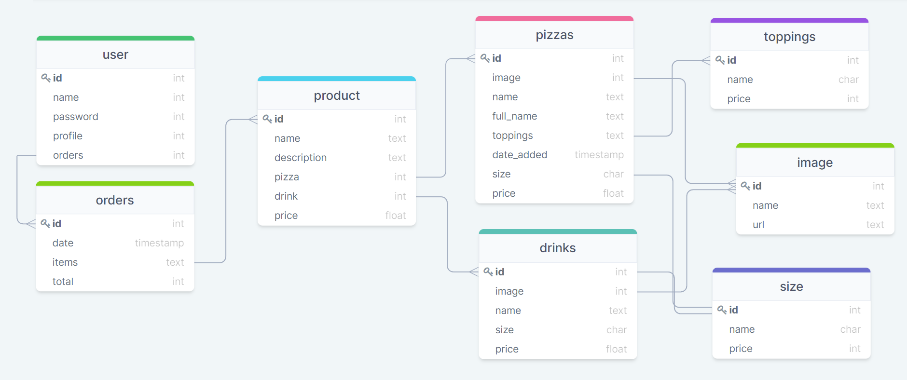

# PIZZA TIME
 

## DO NOT FORGET

1. Switch off development mode
2. Remove EMAIL_BACKEND from project folder settings.py

## USER STORIES

| ID | AS A/AN  | I WANT TO…                                                         | SO I CAN…                                                                  |
|----|-----------|-------------------------------------------------------------------|----------------------------------------------------------------------------|
|    |           |**Viewing and Navigation**                                         |                                                                            |
| 1  | Customer  | View a list of products                                           | Select products to order                                                   |
| 2  | Customer  | View individual product information                               | Identify the price, ingredients, allergy advise, rating, image and sizes   |
| 3  | Customer  | Quickly identify deals and new products                           | Take advantage of special offers and new products I might want to try      |
| 4  | Customer  | Easily view the total of my purchases at any time                 | Keep control on my spendings, avoid errors                                 |
| 5  | Site User | See Cookies notification                                          | To ensure I have control of gathered personal data                         |
| 6  | Site User | Be able to trigger a dark mode                                    | To ensure my eyes rest when browsing in dark environment                   |
| |           |                                                                   |                                                                            |
|    |           |**Registration and User Accounts**                                 |                                                                            |
| 7  | Site User | Easily register an account                                        | Register an account to view own profile                                    |
| 8  | Site User | Log in and log out                                                | Access my personal account                                                 |
| 9  | Site User | Password recovery                                                 | Recover access to my personal account                                      |
| 10 | Site User | Email confirmation after registering                              | Verify successful account registration                                     |
| 11 | Site User | Personalized user profile                                         | Save delivery and payment preferences, view order history                  |
| 12 | Site User | Purchase free delivery subscription                               | Pay monthly fee and save in case of frequent orders                        |
| |           |                                                                   |                                                                            |
|    |           |**Sorting and Searching**                                          |                                                                            |
| 13 | Customer  | Sort available products                                           | Easily identify the best rated, best prices and by name sorted products    |
| 14 | Customer  | Search for a product by name or ingredient                        | Search for a specific product I’d like to order                            |
| |           |                                                                   |                                                                            |
|    |           |**Ordering and Checkout**                                          |                                                                            |
| 15 | Customer  | Select size and quantity of a product I want to order             | Ensure I don’t accidentally select the wrong product, its quantity or size |
| 16 | Customer  | View products in shopping bag to be ordered                       | Ensure the total cost of my order and all products I will receive          |
| 17 | Customer  | Adjust the quantity of individual items in my bag                 | Easily make changes to my order before checkout                            |
| 18 | Customer  | Easily enter/choose payment method                                | Check out quickly and easily                                               |
| 19 | Customer  | Ensure that my personal and payment information is safe and secure| Confidently provide the information needed to complete an order            |
| 20 | Customer  | View an order confirmation after checkout                         | Verify that I haven't made any mistakes in my order                        |
| 21 | Customer  | Receive an email confirmation after checking out                  | Keep the confirmation of my order details for own records                  |
| |           |                                                                   |                                                                            |
|    |           |**Admin and Store Management**                                     |                                                                            |
| 22 | Owner     | Add a product                                                     | Add new items to my store                                                  |
| 23 | Owner     | Edit/Update a product                                             | Change product name, image, items, price, etc.                             |
| 24 | Owner     | Delete a product                                                  | Remove items that are no longer available.                                 |
| 25 | Owner     | Add a deal                                                        | Add new deals to my store                                                  |
| 26 | Owner     | Edit/Update a deal                                                | Change deal criteria                                                       |
| 27 | Owner     | Delete a deal                                                     | Remove deals that are no longer available.                                 |

## WIREFRAMES

I used [Balsamic](https://balsamiq.com/wireframes/) to create wireframes for my project.   

* [Home page](readme-img/wireframes/home.png)  
* [Login](readme-img/wireframes/log-in.png)  
* [Register](readme-img/wireframes/register.png)  
* [My Profile](readme-img/wireframes/profile.png)  
* [My Order](readme-img/wireframes/my-order.png)
* [Delivery & Payment](readme-img/wireframes/delivery-payment.png)
* [Contact Us](readme-img/wireframes/contact-us.png)
* [Delivery Info/About Us/Allergy Advice](readme-img/wireframes/info.png)  

## DATABASE STRUCTURE

I used [drawSQL](https://drawsql.app/) to structure database for this project. See image below to see all connections between DB models.

## Tech used

* Allauth - command: `django-allauth` - used for authentication
* [Glassmorphism](https://hype4.academy/tools/glassmorphism-generator) - used to achieve frosted effects gor navigation
* [Bootstrap](https://getbootstrap.com/) - for grid and some styling

## Sources

* Homepage image was taken from [Unsplash](https://unsplash.com/) and then removed background with [Inpixio](https://www.inpixio.com/remove-background/) for higher resolution outcome, as [removebg](www.removebg.com) has poor quality in their free service.

* https://docs.djangoproject.com/en/4.0/topics/db/models/

## Difficulties faced

1. Project folder settings.py had automatically generated SECRET KEY, I pushed it accidentally with Initial Commit. Resolved by: Changed secret key and moving it to env.py file. Env.py file was added to .gitignore and SECRET_KEY variable linked to Env.py in project's settings.py file.

2. 

