# **PizzaTime** TESTING

## Table of contents

* [Navigation](#navigation)
* [Home](#home)
* [Pizzas](#pizzas)
* [Drinks](#drinks)
* [About](#about)
* [Allauth](#allauth)
* [Product Management](#product-management)
* [Checkout](#checkout)
* [My Order](#my-order)
* [My Profile](#my-profile)
* [Contact Us](#contact-us)
* [Footer](#footer)
* [Conclusion](#conclusion)

## Navigation

### Links
* Logo: takes user to home page
* Address: takes user to Google Maps page (opens Google Maps app on Samsung S10+)
* Home: takes user to home page
* Pizzas: takes user to products page with "pizza" category
* Drinks: takes user to products page with "drink" category
* About: takes user to About Us page
* Contact Us: takes user to Contact Us page
* User Icon: 
    * dropdown works as intended
    * Register: rakes you to register page
    * Login: takes you to login page
    * If authenticated as superuser - Product Management takes user to relevant page
    * If authenticated as superuser - Admin takes user to Django admin page
* Basket Icon: takes user to My Order page

---

[Back to Top](#table-of-contents)

 

## Home

### Links
* Order Now: takes user to products page with "pizza" category

### Lighthouse
Mobile:

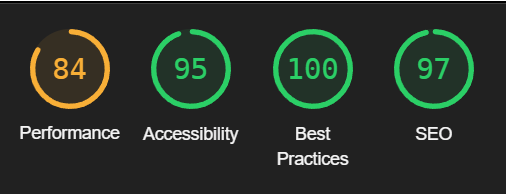

Desktop:

---

[Back to Top](#table-of-contents)

 

## Pizzas

### Links
* Product Size: selects clicked size
* Decrease Quantity button: decreases quantity, does not decrease less than 1, otherwise works as intended
* Increase Quantity button: increases quantity, does go over 99, but shows validation error when Add to Order clicked
* Add to Order button: adds selected size and quantity to order
* Like: adds a like, changes color
* If authenticated as superuser - Edit: redirects to selected products Product Management page
* If authenticated as superuser - Delete: removes selected item

### Lighthouse
Mobile:

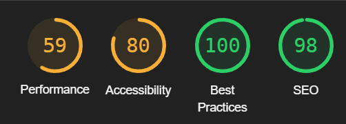

Desktop:

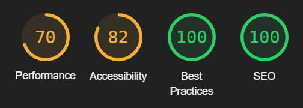

Low Scores mainly due to large product images, decided to leave it to keep picture quality

---

[Back to Top](#table-of-contents)

 

## Drinks

### Links
* Product Size: selects clicked size
* Decrease Quantity button: decreases quantity, does not decrease less than 1, otherwise works as intended
* Increase Quantity button: increases quantity, does go over 99, but shows validation error when Add to Order clicked
* Add to Order button: adds selected size and quantity to order
* If authenticated as superuser - Edit: redirects to selected products Product Management page
* If authenticated as superuser - Delete: removes selected item

---

[Back to Top](#table-of-contents)

 

## About

### Links
* Address: takes user to Google Maps page (opens Google Maps app on Samsung S10+)
* Phone number: offers to call from connected phone (opens phone app on Samsung S10+)
* Contact form: takes user to Contact Us page
* Map: map functionality works as intended

### Lighthouse
Mobile:

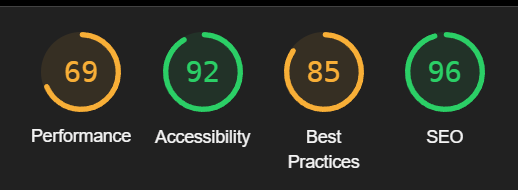

Desktop:

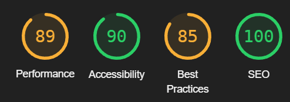

Low Scores mainly due map as it contains heavy JS

---

[Back to Top](#table-of-contents)

 

## Contact Us

### Links
* Phone number: offers to call from connected phone (opens phone app on Samsung S10+)
* Form: validation works as intended
* Send button: submits the form and resets it

### Lighthouse
Mobile:

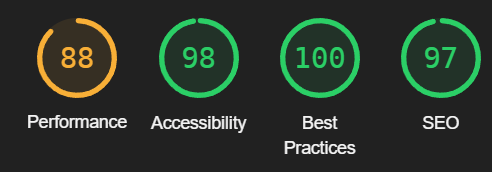

Desktop:

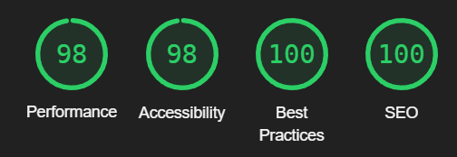

---

[Back to Top](#table-of-contents)

 

## Allauth

### Links
* Sign in link: takes user to sign in page
* Form: validation works as intended
* Sign Up button: submits the form and resets it
* Sign up link: takes user to sign in page
* Form: validation works as intended
* Sign In button: submits the form and resets it
* Home link: takes user to home page
* Forgot Password: takes user to relevant page

### Lighthouse
Mobile:

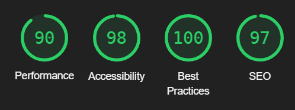

Desktop:

---

[Back to Top](#table-of-contents)

 

## Product Management

### Links
* Form: validation works as intended
* Add Product button: submits the form and resets it
* Back link: takes user to previous page
* Edit: redirects to selected products Product Management page
* Delete: removes selected item

### Lighthouse
Mobile:

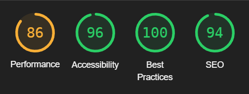

Desktop:

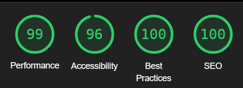

---

[Back to Top](#table-of-contents)

 

## Checkout

### Links
* Form: validation works as intended
* Sign In button: submits the form and resets it
* Adjust Order link: takes user to My Order page

### Lighthouse
Mobile:

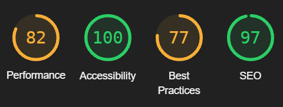

Desktop:

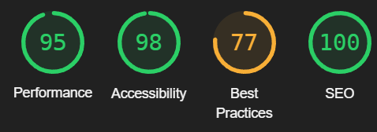

---

[Back to Top](#table-of-contents)

 

## My Order

### Links
* Decrease Quantity button: decreases quantity, does not decrease less than 1, otherwise works as intended
* Increase Quantity button: increases quantity, does go over 99, **needs investigation**
* Go to checkout button: takes user to checkout page
* Update: updates quantity
* Remove: removes item

### Lighthouse
Mobile:

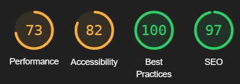

Desktop:

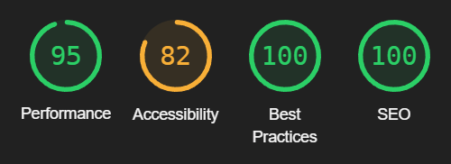

---

[Back to Top](#table-of-contents)

 

## My Profile

### Links
* Form: validation works as intended
* Update button: submits the form and resets it
* Order link: opens order history page

### Lighthouse
Mobile:

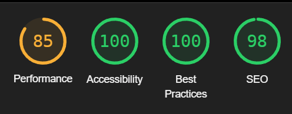

Desktop:

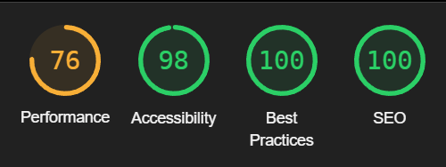

---

[Back to Top](#table-of-contents)

 

## Footer

### Links
* Logo: takes user to home page
* Address: takes user to Google Maps page (opens Google Maps app on Samsung S10+)
* Phone number: offers to call from connected phone (opens phone app on Samsung S10+)

* Facebook: opens new tab with Facebook
* Instagram: opens new tab with Instagram
* Pinterest: opens new tab with Pinterest

* Home: takes user to home page
* Pizzas: takes user to products page with "pizza" category
* Drinks: takes user to products page with "drink" category
* About: takes user to About Us page
* Contact Us: takes user to Contact Us page

---

[Back to Top](#table-of-contents)

 

## Conclusion

Hero image seems to be fine on all sizes, products page in different categories looks good, responsiveness seems to be working everywhere as it should. All links across webapp are working as they should. Users tories are fulfilled and tested during production. Users and customers can see all information as intended, UX is clear and understandable.

---

[Back to Top](#table-of-contents)

 

