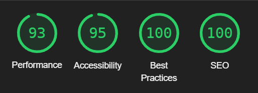
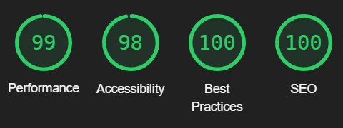

# **PizzaTime** TESTING

## Table of contents

* [Navigation](#navigation)
* [Home](#home)
* [Pizzas](#pizzas)
* [Drinks](#drinks)
* [About](#about)
* [Allauth](#allauth)
* [Product Management](#product-management)
* [Checkout](#checkout)
* [My Order](#my-order)
* [My Profile](#my-profile)
* [Contact Us](#contact-us)
* [Footer](#footer)
* [Conclusion](#conclusion)

## Navigation

### Links
* Logo: takes user to home page
* Address: takes user to Google Maps page (opens Google Maps app on Samsung S10+)
* Home: takes user to home page
* Pizzas: takes user to products page with "pizza" category
* Drinks: takes user to products page with "drink" category
* About: takes user to About Us page
* Contact Us: takes user to Contact Us page
* User Icon: 
    * dropdown works as intended
    * Register: rakes you to register page
    * Login: takes you to login page
    * If authenticated as superuser - Product Management takes user to relevant page
    * If authenticated as superuser - Admin takes user to Django admin page
* Basket Icon: takes user to My Order page

### User Stories

* Easily view the total amount of my purchases at any time
    As a user I add product to order and can see total amount of my order by the baket icon

---

[Back to Top](#table-of-contents)

 

## Home

### Links
* Order Now: takes user to products page with "pizza" category

### Lighthouse
Mobile:

Desktop:

---

[Back to Top](#table-of-contents)

 

## Pizzas

### Links
* Product Size: selects clicked size
* Decrease Quantity button: decreases quantity, does not decrease less than 1, otherwise works as intended
* Increase Quantity button: increases quantity, does go over 99, but shows validation error when Add to Order clicked
* Add to Order button: adds selected size and quantity to order
* Like: adds a like, changes color
* If authenticated as superuser - Edit: redirects to selected products Product Management page
* If authenticated as superuser - Delete: removes selected item

### Lighthouse
Mobile:

Desktop:

Low Scores mainly due to large product images, decided to leave it to keep picture quality

### User Stories
* View a list of products
* View individual product information  
    When user opens Pizza link (or Drinks), they can see products list and every product has image, name, likes, if it is pizza - user can see all toppings
* Browse available products by category
    User can select Pizzas or Drinks categories of products in the main navigation
* See popularity of a product
* 'Like' a product
    On products page user can see how many likes product has, if authenticated - user can "Like" desired produce and increase it's popularity
* Select size and quantity of a product I want to order
    In the products page, on every individual product user can select size and amend quantity of a desired product

---

[Back to Top](#table-of-contents)

 

## Drinks

### Links
* Product Size: selects clicked size
* Decrease Quantity button: decreases quantity, does not decrease less than 1, otherwise works as intended
* Increase Quantity button: increases quantity, does go over 99, but shows validation error when Add to Order clicked
* Add to Order button: adds selected size and quantity to order
* If authenticated as superuser - Edit: redirects to selected products Product Management page
* If authenticated as superuser - Delete: removes selected item

---

[Back to Top](#table-of-contents)

 

## About

### Links
* Address: takes user to Google Maps page (opens Google Maps app on Samsung S10+)
* Phone number: offers to call from connected phone (opens phone app on Samsung S10+)
* Contact form: takes user to Contact Us page
* Map: map functionality works as intended

### Lighthouse
Mobile:

Desktop:

Low Scores mainly due map as it contains heavy JS

---

[Back to Top](#table-of-contents)

 

## Contact Us

### Links
* Phone number: offers to call from connected phone (opens phone app on Samsung S10+)
* Form: validation works as intended
* Send button: submits the form and resets it

### Lighthouse
Mobile:

Desktop:

### User Stories
* Contact Business in variety of ways
    Once user opens contact us page, they can see and submit a contact form, as well as phone number is provided.

---

[Back to Top](#table-of-contents)

 

## Allauth

### Links
* Sign in link: takes user to sign in page
* Form: validation works as intended
* Sign Up button: submits the form and resets it
* Sign up link: takes user to sign in page
* Form: validation works as intended
* Sign In button: submits the form and resets it
* Home link: takes user to home page
* Forgot Password: takes user to relevant page

### Backend
All procedures with logging in, registering and forgot password are working fine.

### Lighthouse
Mobile:

Desktop:

### User Stories
* Easily register an account
* Log in and log out 
    Once user opens any allauth page, they have authentication form relevant to a page, user can register or log in to an account.
* Password recovery
    On login page user can click "Forgot Password" link and will be redirected to recovery page.
* Email confirmation after registering
    Email is sent to validate customers email

---

[Back to Top](#table-of-contents)

 

## Product Management

### Links
* Form: validation works as intended
* Add Product button: submits the form and resets it
* Back link: takes user to previous page
* Edit: redirects to selected products Product Management page
* Delete: removes selected item

### Lighthouse
Mobile:

Desktop:

### User Stories
* Add a product
* Edit/Update a product
* Delete a product
    When authenticated as a superuser they gain access to product management, they can CRUD all products available in database.

---

[Back to Top](#table-of-contents)

 

## Checkout

### Links
* Form: validation works as intended
* Sign In button: submits the form and resets it
* Adjust Order link: takes user to My Order page

### Backend
Stripe works as it should in testing mode. No errors in webhooks noticed. Confirmation email is present and correct.

### Lighthouse
Mobile:

Desktop:

### User Stories
* Easily enter payment method
* Ensure that my personal and payment information is safe and secure
    On checkout form user can fill in all billing and payment information. If authenticated - saved delivery information in users profile will be available in checkout form 
* View an order confirmation after checkout
    After user has checked out, they are redirected to confirmation page with their order and delivery/contact information
* Receive an email confirmation after checking out
    After checkout user receives an confirmation email with their order details

---

[Back to Top](#table-of-contents)

 

## My Order

### Links
* Decrease Quantity button: decreases quantity, does not decrease less than 1, otherwise works as intended
* Increase Quantity button: increases quantity, does go over 99, **needs investigation**
* Go to checkout button: takes user to checkout page
* Update: updates quantity
* Remove: removes item

### Lighthouse
Mobile:

Desktop:

### User Stories

* View products in my order to be ordered 
* Adjust the quantity of individual items in my order
    Once User has added product to an order, they can click on a Bascet icon and open their order. On My Order page customer can see all items to be ordered, amend their quantity or remove items from order.

---

[Back to Top](#table-of-contents)

 

## My Profile

### Links
* Form: validation works as intended
* Update button: submits the form and resets it
* Order link: opens order history page

### Lighthouse
Mobile:

Desktop:

### User Stories
* Personalized user profile
    Once user is logged in, the can access their profile page and see all orders, update delivery information.

---

[Back to Top](#table-of-contents)

 

## Footer

### Links
* Logo: takes user to home page
* Address: takes user to Google Maps page (opens Google Maps app on Samsung S10+)
* Phone number: offers to call from connected phone (opens phone app on Samsung S10+)

* Facebook: opens new tab with Facebook
* Instagram: opens new tab with Instagram
* Pinterest: opens new tab with Pinterest

* Home: takes user to home page
* Pizzas: takes user to products page with "pizza" category
* Drinks: takes user to products page with "drink" category
* About: takes user to About Us page
* Contact Us: takes user to Contact Us page

---

[Back to Top](#table-of-contents)

 

## Conclusion

Hero image seems to be fine on all sizes, products page in different categories looks good, responsiveness seems to be working everywhere as it should. All links across webapp are working as they should. Dome productivity drops here and there due to high product resolution images. In some cases there is heavy JS, will have to investigate.

---

[Back to Top](#table-of-contents)

 

